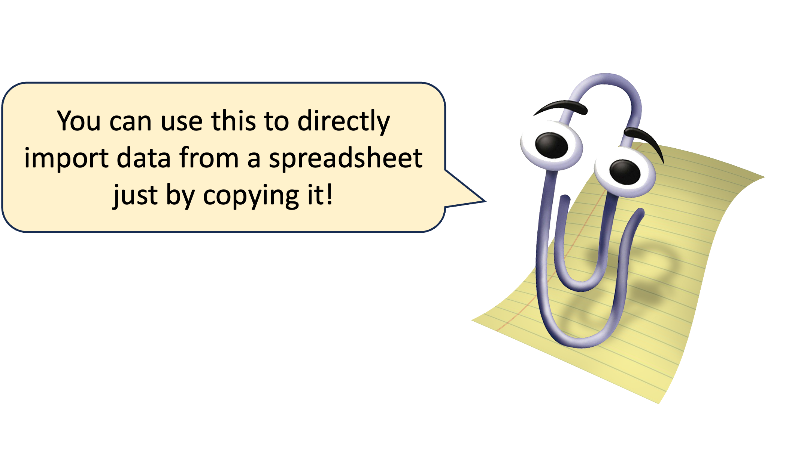
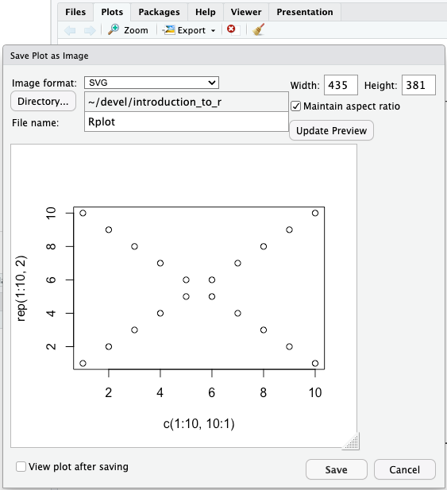

```{r setup, include=FALSE}
# setwd("this/is/a/path)

knitr::opts_chunk$set(
  echo=TRUE,
  root.dir=getwd())
```

## Recapping

**Session 1** covered:

- Introduction to `R` and `RStudio`

- Basic syntax

- Basic data types

- Functions

- Arithmetic and logical operators

- Vectors, data frames, and factors

- Indexing

- Reading data

- Plotting with base R

## Recapping as code

```{r, eval=FALSE}
# Comments can be used to document code

# Assigning variables / objects
# Arithmetic and logical operations
result = 4 * (5/10)^2 - 1
result == 0

# Functions, arguments, and help
?sqrt()
sqrt(25)

# Reading vector and tabular data
samples = scan("samples.txt", what="character")
experiment = read.delim("tabular_file.txt")

# Accessing columns by name, indexing
experiment$treatment[1:3]

# Filtering data
treatment_a_subset = experiment[experiment$treatment=="a", ]
```

---

```{r, eval=FALSE}
# Exploring and summarising data
sex_vs_treatment = table(experiment$sex, experiment$treatment)
summary(experiment$new_mass, experiment$old_mass)

# Creating factors
experiment$treatment = factor(experiment$treatment)
experiment$timepoint = factor(experiment$timepoint, ordered=TRUE)

# Merging data frames
experiment = merge(experiment, extra_data, by="SampleID")

# Creating columns
experiment$response = experiment$new_mass - experiment$old_mass

# Making basic plots
boxplot(response~treatment, data=experiment)
```

## Homework {data-background=#FDEBD0}

What did you learn?

Do we need to recap any parts?

## Learning objectives

**Session 2**

- Reading data (again)
  
- Writing data and images
  
- Saving objects

- Matrices and lists
  
- Coercion
  
- Recycling

- Conditional statements
  
- Loops

- Apply

## Reading data (again)

The data in this course is carefully curated. Real data is messy.

It's worth going over some of the arguments to `read.delim()` and `read.csv()` that might help you import your own data:

- `header=TRUE` can be set to `FALSE` if there is no header row

- `skip=0` specifies the number of lines to skip at the start of the file

- `row.names` can be set to a quoted column name or to a column number to automatically import a column as row names

- `check.names=TRUE` controls whether row and column names are sanitised

- `comment.char=""` can be used to specify that `#` character lines are comments, for example

- `stringsAsFactors=FALSE` specifies whether character columns should be converted to factors

- `dec="."` as some countries use `,` as a decimal point, you can specify that here

---

`read.delim()` and `read.csv()` have other tricks as well, like reading from URLs ...
                        
```{r, eval=FALSE}
data = read.delim(
  "https://raw.githubusercontent.com/LMSBioinformatics/Introduction_to_R/main/content/data/1_read_delim.txt")
```

... and from the clipboard.
                        
```{r, eval=FALSE}
# Windows
data = read.delim("clipboard")

# Mac
data = read.delim(pipe("pbpaste"))
```

<center>
{width="40%"}
</center>

## Writing vectors

Individual vectors can be written to a file using the `write()` function, the write-equivalent of `scan()`.

```{r, eval=FALSE}
write(1:10, "outputs/2_write_vector.txt")
```

There are a few optional arguments to the function:

- `ncolumns` defines the number of elements to output per row of the file

- `sep=" "` defines the separator character. This can be set to be tab-delimited (`sep="\t"`), comma, or new-line-delimited (`sep="\n"`)

- `append=FALSE` can be set to `TRUE` to append to the end of an existing file rather than overwriting it.

## Writing tabular data

Data frame and matrix objects can be output using the `write.table()` function.

```{r, eval=FALSE}
x = data.frame(a=c(1, 2, 3), b=c("a", "b", "c"))
rownames(x) = c("first", "second", "third")

write.table(
  x, "outputs/2_write_data_frame.tsv",
  sep="\t", quote=FALSE, col.names=NA)
```

Again, there are some optional arguments to consider:

- `sep=" "` needs to be manually set to a `","` or a tab (`"\t"`) character

- `quote=TRUE` controls the "quoting" of character elements. You probably want to set this to `FALSE`

- `row.names=TRUE` controls whether row names are written

- `col.names=TRUE` controls whether column names are written. Where `row.names=TRUE`, this can be set to `NA` to insert a blank cell (`[1, 1]`) to prevent the column names from becoming offset to the left.

---

`write.table()` can't output to a URL (that would be truly impressive) ...

<center>
{width="40%"}
</center>

```{r, eval=FALSE}
# Windows
write.table(
  x, "clipboard",
  sep="\t", col.names=NA)

# Mac
write.table(
  x, pipe("pbcopy"),
  sep="\t", col.names=NA)
```

## Writing graphics

`RStudio` can include rendered graphics automatically within its outputs but we still need to be able to save images separately. We can do this with the built-in graphics functions:

- Useful: `png()`, `svg()`, `pdf()`, `tiff()`

- Not very useful: `jpeg()`, `bmp()`

We'll cover installing `R` packages in more detail in `Session 3` but to hopefully standardise our working environments before we begin exporting graphics, let's make sure we have the following packages installed:

```{r, eval=FALSE}
install.packages(c("Cairo", "svglite"))
```

---

The built-in graphics functions accept common useful arguments such as `width=` and `height=`, although their meanings can differ:

- `svg()` and `pdf()`: sizes are in **inches** (`1 inch == 2.54 cm`)

- `png()`: sizes are in **pixels** by default but the additional `units=` argument can be set separately

These functions initiate the recording of graphical outputs but won't write anything to a file until we inform `R` that we're finished plotting. The `dev.off()` function does this.

```{r, eval=FALSE}
svg("outputs/2_write_image.svg", width=5, height=5)  # begin recording

plot(c(1:10, 10:1), rep(1:10, 2))  # plot something

dev.off()  # stop recording and write the output
```

---

It's worth noting that PDFs are special, as they allow multiple plots to be captured into the same document.

Each plot created before `dev.off()` is called will be created on a new page.

```{r, eval=FALSE}
pdf("outputs/2_write_image.pdf", width=5, height=5)

plot(c(1:10, 10:1), rep(1:10, 2), col="purple")
plot(c(1:10, 10:1), rep(1:10, 2), col="green4")

# other things can go on in within a pdf/svg/png() ... dev.off() block as well
x = 1

dev.off()
```

---

When working in the console, we can also use `RStudio` to interactively resize outputs and to save images.

```
> plot(c(1:10, 10:1), rep(1:10, 2))
```

<center>
{width="40%"}
</center>

## Saving R objects

`R` objects can be saved to allow important steps in a workflow to be preserved or to save the results of a lengthy computation.

The `save()` function can be used to store specific objects ...

```{r, eval=FALSE}
save(x, file="outputs/2_write_object.RData")
```

... or a complete snapshot of the working space can be recorded using `save.image()`.

```{r, eval=FALSE}
save.image("outputs/2_write_image.RData")
```

The objects contained within these files can be loaded into a future `R` session using the `load()` function.

```{r, eval=FALSE}
load("outputs/2_write_object.RData")
```

## Garbage

Saving objects has another advantage; it allows our working areas to be subsequently cleaned up.

Amongst programming languages, `R` is famous as a bit of a 'memory hog'. When performing analyses of particularly large datasets, it can use 10s of GB of your computer's RAM (and/or crash your machine)!

An object can be deleted using the `rm()` (or `remove()`) function ...

```{r}
delete_me = c("please!", "I'm", "taking", "up", "a", "lot", "of", "memory.")
rm(delete_me)
```

... which will remove it from use but doesn't actually free its memory. We can encourage `R` to perform this second step by manually calling the `gc()` (garbage collection) function.

```{r, eval=FALSE}
gc()
```

## Matrices

Complementing the data frame, the `matrix` is the second 2D tabular structure in base `R`. As with vectors, all data within a matrix must be of the same underlying class: `numeric`, `character`, or `logical`.

The `matrix()` function can be used to form a matrix from a single vector and to automatically assign a given shape, filling column-wise by default or row-wise by passing the `byrow=TRUE` optional argument.

```{r}
matrix(1:8, nrow=2, ncol=4)
```

```{r}
matrix(1:8, nrow=2, ncol=4, byrow=TRUE)
```

---

```{r}
m = matrix(1:8, nrow=2, ncol=4, byrow=TRUE)
class(m)
```

Outside of demonstrating the `matrix()` function, it's rare in the real world to create a matrix this way.

Mostly commonly, we create a matrix from a file by converting the data frame produced by `read.delim()` or `read.csv()` using the `as.matrix()` function.

```{r}
m = as.matrix(read.delim("data/2_read_matrix.txt", row.names="ID"))
m
```

---

Alternatively, we can also create matrix objects from existing vectors using the `rbind()` (row bind) function ...

```{r}
a = c(1, 2)
b = c(4, 5)
rbind(a, b)
```

... or the `cbind()` (column bind) function.

```{r}
m = cbind(a, b)
m
```

---

Both functions also work to extend an existing matrix object.

```{r}
m = rbind(m, c(3, 6))
m
```

```{r}
m = cbind(m, c=c(7, 8, 9))
m
```

---

We can also use `cbind()` to extend an existing matrix using another matrix.

```{r}
m = cbind(m, m)
m
```

## Matrix indexing

Square bracket (`[  ]`) indexing of matrix objects works in the same way as for data frames.

```{r}
m[1, ]
```

```{r}
m[, 1]
```

```{r}
m[1:2, 1:2]
```

---

As with the data frame, the dimensions of a matrix can be determined with the `nrow()`, `ncol()`, and `dim()` functions.

Similarly, the `rownames()` and `colnames()` functions can be used to get and set names.

```{r}
rownames(m) = c("one", "two", "one")
m
```

In comparison to a data frame, as can be seen above, row and column names do not have to be unique in a matrix. As a result:

- the matrix does not support column referencing with the `$` operator

- though supported, name-based indexing (e.g. `["one", ]`) can cause unexpected issues

It is good practice to enforce unique naming yourself on behalf of your matrices!

## Practical {data-background=#D6EAF8}

As we need to work on our row and column names:

- what does the `paste()` function do?

- how can we use this function to rename our columns `col1`--`col6` and the rows `row1`--`row3`?

Working on our matrix:

- what does `m * 2` do?

- what does `m * 1:3` do?

- what does `m * m` do?

## Transposition

Most functions expect matrix data inputs to be column-wise (samples in columns, observations in rows). Some, however, expect row-wise inputs. The `t()` function can be used to *transpose* a matrix.

```{r}
m = matrix(1, nrow=4, ncol=2)
m
```

```{r}
t(m)
```

## Coercion

Individual vectors and matrix objects can store only single data types. It's worth looking into this in more detail, as *coercion* (conversion between types) has some gotchas.

Where a mixed input is given, `R` makes a decision about the most suitable data type and *coerces* everything else to match. The decision it takes follows a set path:

- can all the elements be represented as `logical`?

- otherwise, as `numeric`?

- otherwise, as `character`?

- else, they're `NA`

Importantly, if you add elements of a different data type to an existing vector or matrix, the whole object will be coerced to match.

---

```{r}
im_being_coerced = c(TRUE, FALSE)
im_being_coerced
```

```{r}
c(im_being_coerced, 1.0)
```

```{r}
c(im_being_coerced, 10, "hello")
```

---

Sometimes it's useful to take control the coercion yourself. Each basic type has a matched `as.` function that will convert an input appropriately.

```{r}
as.numeric(c(TRUE, 1, FALSE, 0))
```

Even here, though, there are limits! Where the requested coercion isn't possible, `NA` values will be inserted.

```{r}
as.numeric(c(TRUE, 1, FALSE, 0, "testing"))
```

Best practice, therefore, is not to find yourself in this situation in the first place!

## Recycling

Vector-vector and vector-matrix operations with unequal length objects cause the shorter to be *recycled*.

```{r}
a = rep(1, 6)
b = c(0, 1)
a + b
```

Here, the shorter object, `b`, is used more than once - it's recycled. This works whether the longer length is an exact multiple of the shorter or not, but will print a warning in the latter case.

```{r}
rep(1, 5) * b
```

---

We can exploit recycling when adding repetitive columns or rows to a matrix with `cbind()` or `rbind()`.

```{r}
cbind(matrix(1, nrow=4, ncol=2), c(0, 1))
```

```{r}
rbind(matrix(1, nrow=2, ncol=5), c(0, 1))
```

---

Though `cbind()` does not allow longer columns to be added, `rbind()` does allow a longer vector to be added as a row.

In this case, a warning is printed and the vector is truncated to match the number of columns in the matrix.

```{r}
rbind(matrix(0, nrow=2, ncol=2), c(1, 1, 1, 1))
```

## Lists

The `list` object, returned by the `list()` function, provides a general container class. In comparison to data frames and matrices, lists can be used to store objects of different lengths.
            
```{r}
samples = c("S1", "S2", "S3", "S4")
expression = matrix(1, nrow=2, ncol=4)
meta_data = data.frame(
  samples=samples,
  treatment=rep(c(TRUE, FALSE), 2),
  replicate=c(1, 1, 2, 2))

experiment = list(samples, expression)
str(experiment)
```

---

Similarly to vectors, lists can be extended using the `c()` function, but we need to make sure that everything being joined is a list object.

```{r}
experiment = c(experiment, list(meta_data))
str(experiment)
```

---

A process unique to list objects is *flattening*. When a list contains objects of the same type (e.g. all vectors), the `unlist()` function can be used to create a flat representation (a vector).

```{r}
vector_list = list(
  first=c(1, 2, 3),
  second=c(4, 5, 6),
  third=c(7, 8, 9))

unlist(vector_list)
```

If the elements of the original list were named, the unlisted elements are given the name with an additional numeric suffix.

## Indexing lists

As with data frames, we can index lists using the special `$` operator to retrieve named elements. Names can be set when the list is created ...

```{r}
experiment = list(
  samples=samples,
  expression=expression,
  meta_data=meta_data)
```

... or by using the `names()` function.

```{r}
names(experiment) = c("samples", "expression", "meta_data")
```

---

Indexing lists with square brackets requires a little more thought. Whereas the `$` operator retrieves the element ...

```{r}
experiment$samples
```

... indexing with square brackets (`[ ]`) subsets the list, returning another list.

```{r}
experiment["samples"]
```

To recreate the behaviour of the `$`, we instead need to index with double square brackets (`[[ ]]`).

```{r}
experiment[["samples"]]
```

## Practical {data-background=#D6EAF8}

Let's do some list-making!

- Make a named list with the following elements:

  * Your name
  
  * Your age
  
  * The colours of the clothes you're wearing, as a character vector
  
- Update your age to be the equivalent in months

- What does the `sample()` function do?

- Add to your list a random shuffle of the numbers `1`--`10`

- What's the logical coercion of your age? What about your name?

- Your name and age are sensitive under GDPR as they're personally identifying. Delete this list immediately and make sure `R` cleans up after itself!

## Flow control

It's often useful to have control of how and whether blocks of code are executed. This is the concept of *flow control*, which divides into two categories:

- *conditional statements*

  * control whether a particular block of code is executed; execution is *conditional* on a logical test
  
  * return a value. Even if it's not wanted or captured, conditional statements always return something (`NULL` if there's nothing else to return)

- *loops*

  * can run a code block a specified number of times
  
  * can run a code block with different inputs
  
  * don't return anything

## If

Across all programming languages, the `if` statement is the backbone of conditional flow control.

`if` performs the logical test enclosed within brackets (`( )`) and, if the statement evaluates to `TRUE`, runs an adjacent block of code wrapped in a pair of curly brackets (`{ }`).

```{r}
x = 0

if (x < 1) {
  "yes"
}
```

For single line statements, this can also be done *inline*. Here, we also capture the result as a new object.

```{r}
result = if (x < 1) "yes"
```

---

Where the conditional statement evaluates to `FALSE`, we can pair `if` with `else` to run an alternate code block.

```{r}
if (x > 0) {
  "yes"
} else {
  "no"
}
```

Similarly, where the readability of code is not reduced, this can be done inline.

```{r}
result = if (x > 1) "yes" else "no"
result
```

---

It's also possible to *chain* `if` and `else` to evaluate multiple conditions.

```{r}
if (x == 1) {
  "x is 1"
} else if (x == 2) {
  "x is 2"
} else {
  "x is not 1 or 2"
}
```

When capturing answers, it's important to remember that `if` statements always return something! If we don't specify the `else`, there's a default behaviour.

```{r}
result = if (x > 1) "yes" # else NULL
result
```

## Vectorised if

As the `if` statement can only evaluate a single logical condition, `R` has an equivalent vectorised function. `ifelse()` performs the same logic on a vector and returns an equally-sized vector of results.

```{r}
x = -2:2

ifelse(x > 0, "over_0", "under_or_0")
```

Though this can get a little messy, the `ifelse()` function can also be chained ...

```{r}
ifelse(
  x == 0,
  "equal",
  ifelse(x > 0, "over", "under"))
```

## For

In the simplest use case, `for` loops run the encapsulated code block a specified number of times. Note that, as `for` loops don't return anything, we have to manually `print()` the result of the code block.

```{r}
for (i in 1:5) {
  print(i * i)
}
```

Execution is in two steps:

- walking through the supplied vector (`1:5`), the variable `i` is assigned its value

- the code block is executed

---

By convention, we use the variable `i` to store the loop number. It's frequently used as an `i`ndex value.

```{r}
x = -2:2

for (i in 1:5) {
  print(x[i] ^ 2)
}
```

If we're nesting loops inside each other and `i` is in use, we move on to ... `j`.

It's good practice to avoid using `i` and `j` as variable names elsewhere in your code to avoid downstream confusion!

---

<center>
{width="50%"}
</center>

---

`for` loops can also be used to loop over other inputs (... in which case we can use whatever variable names might be suitable).

As with `if`, single line statements can also be run inline.

```{r}
x = letters[1:3]
for (chr in x) print(chr)
```

```{r}
x = list(c(1, 2, 3), c(4, 5, 6))
for (v in x) print(v)
```

## While

`while` loops are most useful when it's known a condition *can* be satisfied but not necessarily *when.*

As long as the specified logical condition evaluates to `TRUE`, the loop keeps running. In other words, it loops repeatedly runs the defined logical condition finally evaluates to `FALSE`.

```{r}
x = 1:3

while (x[1] != 3) {  # i.e. run until x[1] == 3
  x = sample(x)  # shuffle x
  print(x)
}
```

---

Provided that it *can* evaluate to `TRUE`, any logical operation or function can be included within the `while` statement.

```{r}
x = 1
while (x^2 != 9) x = x + 1
x
```

## Next

The `next` keyword causes immediate escape from an individual loop iteration and triggers the next to start.

```{r}
for (i in 1:10) {
  if (i < 10) next
  print(i)
}
```

Here, where `i < 10` for the first 9 iterations, the `next` keyword aborts execution of the code block and triggers to next iteration to begin. Only when the if statement does not evaluate to `TRUE` is the value of `i` printed.

## Break

The `break` keyword can be used to exit from a `for` or `while` loop completely.

```{r}
loops = 0

while (TRUE) {  # this always evaluates to `TRUE`, so the loop will be infinite
  loops = loops + 1
  if (sample(1:20, size=1) == 5) break
}

loops
```

## Practical {data-background=#D6EAF8}

This code produces a random length selection of lowercase characters from the `letters` built-in constant:

```{r, eval=FALSE}
x = sample(letters, size=sample(26, size=1))
```

- If we don't know its length beforehand, how might we write a `for` loop that iterates over this vector?

- Shuffle `letters` yourself, keeping all 26 characters

- Write a `for` loop that iterates over the vector until it finds `z`

- How many iterations did it take to find `z`?

- Translate your code over to work as a `while` loop

## Apply

As noted before, `R` is vectorised! To apply a function to a vector or matrix as a whole, we just do so.

```{r}
x = 1:6
sqrt(x)
```

We don't always want to do this, though! Suppose we want to obtain the `mean()` of each row in a matrix, or the `sum()` of each column.

To achieve this, we can use the `apply()` function to iterate either row- or column-wise over a matrix. `apply()` takes three positional arguments:

- `X`: the matrix

- `MARGIN`: determines whether we're operating on rows (`1`) or on columns (`2`)

- `FUN`: the function to apply

---

```{r}
m = matrix(1:9, nrow=3, ncol=3)
m
```

```{r}
apply(m, 1, sum)  # MARGIN=1 operates on rows
```

```{r}
apply(m, 2, sum)  # MARGIN=2 operates on columns
```

---

By default, `R` doesn't allow functions to be applied to `list` objects, as they specifically allow for storage of heterogeneous data. Where it's known that a list's contents are suitable (e.g. a list of numeric vectors), the `lapply()` function can be used to run a function on its elements. A list of the same structure is returned.

```{r}
x = list(a=c(1, 2, 3), b=c(4, 5, 6))
x
```

```{r}
lapply(x, sqrt)
```

---

The last `apply()` variant that's particularly useful is `tapply()`, which will run a function on specific elements of a vector. Elements can either be defined according to a logical operation or using a vector that can be coerced by `as.factor()`.

```{r}
x = 1:9

tapply(x, x>5, sqrt)
```

```{r}
tapply(x, rep_len(c(0, 1), 9), sqrt)
```

## Sweep

When vector-matrix arithmetic operations are performed, the provided vector is treated as a column (or it's recycled to be one) and is pushed horizontally across the matrix.

```{r}
m = matrix(0, nrow=4, ncol=4)
m + c(0, 1)
```

If we wanted to instead treat the vector as a row and push it vertically down the matrix, we have two options:

- transpose (`t()`) the matrix, perform the operation, and transpose it back again

- use the `sweep()` function

---

`sweep()` is a statistical function designed to normalise a matrix by 'sweeping away' an unwanted factor. In reality, we can use it for anything. `sweep()` expects four positional arguments:

- `X`: the matrix

- `MARGIN`: determines whether we're operating on rows (`1`) or on columns (`2`)

- `STATS`: the vector to use in the sweep

- `FUN`: the function to sweep with. Note that arithmetic functions (`+` etc) need to be quoted (i.e. `"+"`)

```{r}
sweep(m, 2, c(0, 1, 0, 1), "+")
```

## Homework {data-background=#FDEBD0}

There are more penguin-related homework tasks to help cement what we've covered today!

The homework and instructions can be found within the main directory for the course: `./content/Homework_2.Rmd`
