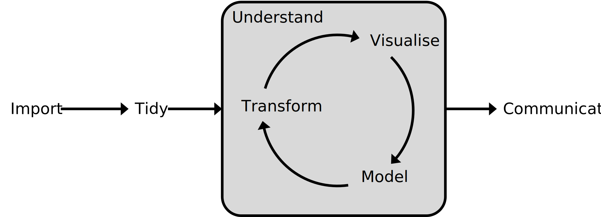

```{r setup, include=FALSE}
knitr::opts_chunk$set(echo=TRUE)
```

## Hello

## Why are we here?

This course aims to teach the fundamentals of the `R` programming language for statistical computing and graphics

We expects no pre-existing knowledge and aim to teach by hands-on application of a typical 'data science workflow'

<center>
{width="75%"}
</center>

## Data science

- **Import**: data can be in many formats, collecting it's the first hurdle

- **Tidy**: *real* data is messy; tidying allows storage in a consistent manner for use downstream

- **Transform**: processing data and creating alternate views aid in interpretation

- **Visualise**: humans are visual - understand and sense-check your data

- **Model**: create interpretations of your data with models and statistical analyses

- **Communicate**: share and record your work in a reproducible manner

## Why `R`?

Applications such as `Excel`, `Prism`, `SigmaPlot` have a number of drawbacks:

- Automated pre-processing can corrupt data

- Analyses are forced to follow a generic workflow

- Functional limitations can slow or hinder analyses

 Large datasets can cause issues

`R`

- Can do whatever you want

- Allows analyses to be recorded or automated

- Has 1000s of packages to call on
  
- Open-source and cross-platform

## Course outline {.columns-2}

**Session 1**

- Introduction to `R` and `RStudio`

- Basic data types

- Functions

- Arithmetic and logical operators

- Vectors, data frames, and factors

- Indexing

- Reading data

- Plotting with base R

<p class="forceBreak"></p>

**Session 2**

- Reading data (again)
  
- Writing data and images
  
- Saving objects

- Matrices and lists
  
- Coercion
  
- Recycling

- Conditional statements
  
- Loops

- Apply

## {.columns-2}

**Session 3**

- R markdown

- Writing functions

- Apply (again)

- Installing packages

- Using packages

- Real life example: DESeq2

<p class="forceBreak"></p>

**Session 4**

- What makes a good figure?
  
- Using colour
  
- `viridis` colour library
  
- Plotting with `ggplot2`
  
##

**Session 5**

- The `tidyverse`

## Learning resources

- [R for Data Science](https://r4ds.hadley.nz/) (Hadley Wickham)

- [An Introduction to R](https://cran.r-project.org/doc/manuals/R-intro.pdf) (`R` Core Team)

- [Data visualisation](https://blogs.nature.com/methagora/2013/07/data-visualization-points-of-view.html) guides from *Nature Methods*
