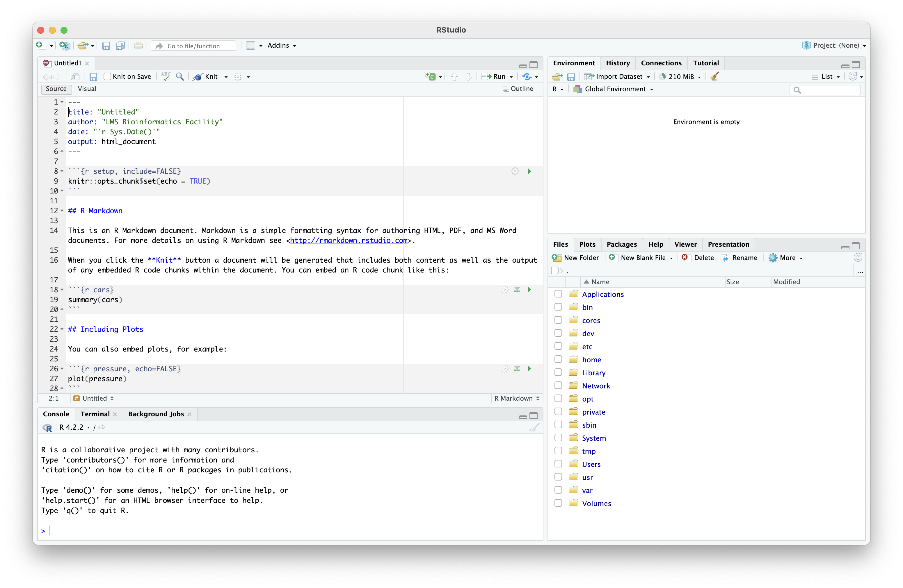
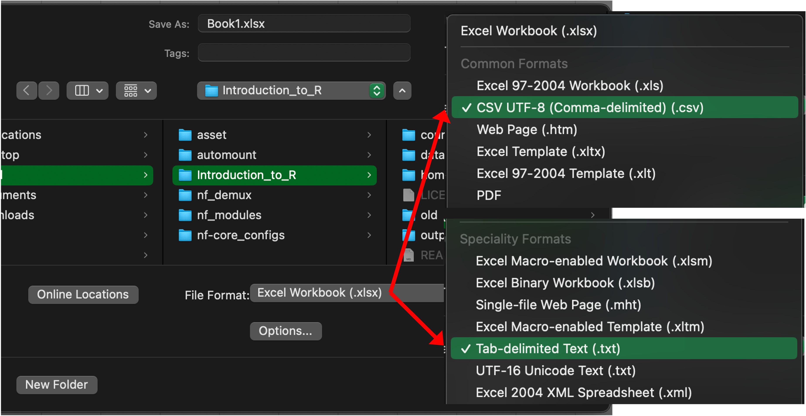

```{r setup, include=FALSE}
# setwd("this/is/a/path)

knitr::opts_chunk$set(
  echo=TRUE,
  root.dir=getwd())
```

## First things first

Get going by downloading and installing `R` and `RStudio` (in that order).

<center>
[{width="20%"}](https://cran.ma.imperial.ac.uk/)

[{width="45%"}](https://posit.co/download/rstudio-desktop/)
</center>

## Learning objectives

**Session 1**

- Introduction to `R` and `RStudio`

- Basic syntax

- Basic data types

- Functions

- Arithmetic and logical operators

- Vectors, data frames, and factors

- Indexing

- Reading data

- Plotting with base R

## RStudio

`RStudio` has a four panel layout: documents, console, environment, and *stuff* (plots, help, files, ...)

<center>
{width="70%"}
</center>

---

- Set the working directory (`Session > Set Working Directory`) to the `working_area` folder

- Open a new document ... `File > New File >`:

  * `R Notebook`: allows you to interleave `R` code, comments, and images. An HTML is automatically produced that records the last outputs when the document is saved
  
  * `R Markdown`: the same, but will an HTML is only produced when asked, and all code is re-run (*knit*) before it's produced

- Commands run in the documents pane and in the console will behave identically. Run a line of code with `⌘+Enter` (Mac) or `CTRL+Enter` (Windows), or by typing it into the console directly.

- Run individual or highlighted lines of code with `⌘+Shift+Enter` (Mac) or `CTRL+Shift+Enter` (Windows)

- Insert a code block at the position of the cursor with `⌘+⌥+I` (Mac) or `CTRL+Alt+I` (Windows)

- Press the `⏵` (run) button to run a code block

- Press `⌘+S` (Mac) or `CTRL+S` (Windows) to save

## Assignment

Let's try some basic calculations. `R` knows all the usual arithmetic operators: `+`, `-`, `/`, `*`, and `^`. By default, results are printed to the screen.

```{r}
1 + 1
```

To store an answer, we must *assign* it with either the `<-` or `=` operator.

```{r}
a <- 10 / 2  # is the same ...
a = 10 / 2   # ... as this
```

Here, an *object* (or *variable*), `a`, is created to store the calculation's result. We can query what `a` stores.

```{r}
a
```

---

Assignment works from right to left. Here, we can say that `b` *becomes equal to* the result of `sqrt(25)`.

```{r}
b = sqrt(25)
b
```

Stored objects appear in `RStudio`'s environment panel. As in algebra, they can be used in calculations.

```{r}
a * b
```

Assigning to an existing object will overwrite its previous value.

```{r}
a = a * b
a
```

## Comments

Comments in your code allow you to keep track of your ideas and to document your work. In `R`, on each line, everything after a `#` symbol is considered a comment and will not be run.

```{r, eval=FALSE}
# This whole line is a comment

a = a * b  # This is a comment as well!
```

We can hijack this system to 'comment out' code sections if we don't want them to run.

```{r, eval=FALSE}
# The following calculation will not run:
# a = a * b
```

For the current or highlighted lines, the `⌘+Shift+C` (Mac) or `CTRL+Shift+C` (Windows) will comment and un-comment lines for you in `RStudio`.

## Object naming

As in all programming languages, in `R`, there are rules about what names an object can be given.

Object names *cannot* start with a number ...

```{r, eval=F}
1var = 1  # will fail
```

... contain special characters (e.g. a minus sign) ...

```{r, eval=F}
my-variable = 1  # will also fail
```

... or contain spaces.

```{r, eval=F}
my variable = 1  # will also also fail
```

---

Object names can only contain numbers, characters, underscores, and points.

Names should be short and meaningful so that you can type them easily and know what they store.

```{r, eval=F}
tcga_data = ...  # a nice, short, meaningful name

the_data_we_got_from_that_2019_paper = ...  # not a good name!

t = ...  # tulip? turtle? time?
```

As spaces aren't allowed, there are are two preferred options instead.

```{r, eval=F}
this_is_called_snake_case = "hello"
```

```{r, eval=F}
thisIsCalledCamelCase = "world"
```

## Functions

`sqrt()` was an example of a *function*. A function runs a pre-determined calculation or procedure, generally (but not always) returning an answer.

```{r}
one_to_ten = seq(1, 10)
one_to_ten
```

```{r}
min(one_to_ten)
```

```{r}
max(one_to_ten)
```

---

`R` is extremely well documented. To find out what a function does or how to use it, use the `?` operator.

```{r}
?mean
```

```
Arithmetic Mean

Description
  Generic function for the (trimmed) arithmetic mean.

Usage
  mean(x, ...)

## Default S3 method:
  mean(x, trim = 0, na.rm = FALSE, ...)

...
```

We can also ask `R` to give an example of the function in use ... though some are a bit complicated!

```{r, eval=FALSE}
example("mean")
```

---

The full *function signature* for `mean()` is `mean(x, trim = 0, na.rm = FALSE, ...)`.

Breaking it down:

- the function name is `mean`

- inputs to the function - its *arguments* - are provided within the brackets

- *required* arguments do not have a preset value (e.g. `x`). They are generally *positional* so that, provided you pass them in the correct order, you don't have to specify their names.

```{r, eval=FALSE}
mean(one_to_ten)  # is the same as ...
mean(x=one_to_ten)  # ... this. The names of positional arguments are implicit
```

- *optional* arguments have a preset value (e.g. `trim = 0`) and, if they're not specified, the preset will be used. For clarity, when we do specify optional arguments, it's good practice to use their names.

```{r, eval=FALSE}
mean(one_to_ten, trim=0.1)
```

## Practical {data-background=#D6EAF8}

Ask `R` what these functions do:

- `mad`

- `ceiling`

- `floor`

- `toupper`

- `range`

## Basic data types

There are three *basic* data types that we use in `R` day-to-day:

- `Numeric` values store a number (with the subclasses `integer` and `double`)

- `Character` values (aka a *string* of characters) wrapped in quotation marks store text

- `Logical` values (aka a *boolean*) store a `TRUE/FALSE` result

The type of an object can be determined using the `class()` function.

```{r}
class(1)
```

```{r}
class("this is a string")
```

## Vectors

Basic data types can be grouped into collections of *elements*. A `vector` is one of the most fundamental, storing elements of the same type.

The `c()` function combines the given elements, flattening any other vectors along the way.

```{r}
c(1, 2, 3)
```

```{r}
c("one", "two", "three", c("four", "five"))
```

```{r}
c(TRUE, FALSE, T, F)
```

---

There are a number of handy functions for creating vectors.

The `seq()` function (or the `:` operator) will create a sequence of numbers

```{r}
seq(11, 20)
```

```{r}
11:20
```

The `rep()` function will repeat a given object a specified number of times

```{r}
a = rep(11:15, 3)
a
```

## Practical {data-background=#D6EAF8}

Let's work out what these will do when making a vector:

- `seq(1, 10, 2)`

- `10:1`

- `c(1:10, 10:1)`

## R is vectorised

Many of the core `R` functions are *vectorised* - i.e. functions are written to operate on all elements of a vector simultaneously.

Vector operations avoid the need to loop through and act on each element individually, making writing code more concise and less error prone. They're also much faster!

```{r}
a ^ 2
```

```{r}
log(a)
```

## Indexing vectors

Specific elements can be extracted from vectors by their position (or *index*) using square brackets (`[ ]`).

```{r}
a[5]
```

```{r}
a[1:3]
```

Conversely, specific elements can be excluded by using a minus sign.

```{r}
a[-c(1, 3, 5)]
```

---

The order of index values matters; `[c(1, 2)]` is different to `[c(2, 1)]`). The order of the supplied index values can be used to arrange data, therefore.

```{r}
a[15:1]
```

`order()` sorts a vector and returns the index values in the order that achieve this representation.

```{r}
order(a)
```

```{r}
a[order(a)]
```

---

Name-based indexing of vectors is also possible.

Names can be assigned to an existing vector by using the `names()` function.

```{r}
a = c(1, 2, 3)
names(a) = c("first", "second", "third")
a
```

Alternatively, names can be supplied when the vector is first created.

```{r}
a = c(first=1, second=2, third=3)
a
```

---

Named vectors can be indexed using square brackets (`[ ]`) (to retain the names) or with double square brackets (`[[ ]]`) (to discard them).

```{r}
a["second"]
```

```{r}
a[["second"]]
```

---

Indexing does not work beyond the bounds of a vector, however - you can't index beyond its length

```{r}
length(a)
```

```{r}
a[4]
```

Here, `R` uses the `NA` (not available) logical constant to signify that the value is missing.

---

Similarly, you can't index a named vector using a name that it doesn't contain.

```{r}
names(a)
```

```{r}
a["fourth"]
```

Again, `R` uses the `NA` (not available) logical constant to signify that the value is missing.

## Practical {data-background=#D6EAF8}

You have inherited 4 penguins from an estranged aunt!

- Make a vector that records their ages in months: 15, 53, 97, and 64.

- Have you chosen a good name?

- Add the information that their names are Basil, Tim, Lisa, and Snapper.

- What are their ages in complete years?

- What is the median age of your penguins?

## Index-based replacement

Specific elements within vectors can be replaced by referencing their index in an assignment operation. This works identically for position-based and name-based indexing.

```{r}
a[1:2] = 0
a
```

```{r}
a[c("first", "second")] = c(1, 2)
a
```

## Logical operations

Two objects can be compared to one another using *logical operations*:

- `x == y` ... is equal to

- `x != y` ... is not equal to

- `x > y` ... is greater than (`>=` or equal to)

- `x < y` ... is less than (`<=` or equal to)

These return a logical `TRUE/FALSE` answer.

```{r}
1 > 2
```

## Logical operations on vectors

Logical operators are vectorised in `R`; when run on a vector, they return a logical vector of the same length ...

```{r}
a <= 2
```

... which can be used to subset the original vector.

```{r}
a[a <= 2]
```

---

Asking whether a variable is contained within a vector is an example of a *set membership query* and can be performed using the `%in%` operator. As with other logical operators, these are vectorised in `R` ...

```{r}
b = c(3, 4, 5)
a %in% b
```

... and can be used for subsetting.

```{r}
a[a %in% b]
```

---

As stated, when run on a vector, these operations return a logical vector of the same length.

If it's preferable to just have a list of the indices that satisfy a given logical criteria, the `which()` function can be used instead ...

```{r}
which(a %in% b)
```

... which can be used to subset the original vector in exactly the same way.

```{r}
a[which(a %in% b)]
```

## Modifying logicals

Single logical variables or vectors of them can be combined and manipulated with the `&` (and), `|` (or), and `!` (not) operators.

```{r}
TRUE & FALSE  # do both objects evaluate to TRUE?
```

```{r}
c(TRUE, FALSE, FALSE) | c(TRUE, TRUE, FALSE)  # in pairs, does either evaluate to TRUE?
```

```{r}
!(1 > 2)  # the `not` operator inverts the answer 
```

## Practical {data-background=#D6EAF8}

Many Emperor penguins don't start breeding until they're 6 years old.

- Which of your penguins are too young to breed?

To bump up your numbers, you decide to get more penguins.

- Update your vector to add Erica (99) and Jen (107)

## Reading data into vectors

Vectors can be created from simple text files by using the `scan(file, what)` function. We pass two important arguments:

- `file` ... the location of the file to be read

- `what` ... the basic data type that it contains: character, numeric, or logical

```{r}
my_first_data = scan("data/1_scan.txt", "character")
my_first_data
```

## Data frames

The `data.frame()` function can be used to combine individual vectors into columns of a unified table.

Separate columns can be used to store different data types but each column is still an individual vector ... and vectors can only store a single data type.

```{r}
df = data.frame(col1=c(1, 2, 3), col2=c("one", "two", "three"))
df
```

```{r}
class(df)
```

---

As data frames are two dimensional, different functions are required to manipulate them.

Columns can be added using `cbind()` (column bind) ...

```{r}
df = cbind(df, col3=c(TRUE, FALSE, TRUE))
df
```

... or using the special `$` operator.

```{r}
df$col4 = c(1.1, 1.2, 1.3)
df
```

--- 

Similarly, instead of `names()`, there are `rownames()` ...

```{r}
rownames(df) = c("a", "b", "c")
df
```

... and `colnames()`.

```{r}
colnames(df) = toupper(colnames(df))
df
```

In a data frame, column and row names must be unique. Duplicate names are not allowed!

---

Instead of `length()`, to get the size of a data frame, we can use `nrow()` ...

```{r}
nrow(df)
```

... `ncol()` ...

```{r}
ncol(df)
```

... or, to get both together, `dim()`.

```{r}
dim(df)
```

## Indexing data frames

To access the information within a data frame, as with vectors, we use square brackets (`[ ]`). However, we must now define both row and column positions:

- `[r, ]` ... index values before the comma refer to rows

- `[, c]` ... index values after the comma refer to columns

- Omitting either one, as above, will return all possibilities.

```{r}
df[2, ]  # take row 2, take all columns
```

```{r}
df[, 2]  # take all rows, take column 2
```

---

As with named vectors, we can also index by row and column name ...

```{r}
df[c("a", "b"), ]  # take the rows named "a" and "b"
```

```{r}
df[, "COL1"]  # take the column named "COL1"
```

... and we can access columns individually with the `$` operator, which returns the underlying vector.

```{r}
df$COL1
```

## Reading data into data frames

Tabular plain-text formats can be exported from most software. In `Excel` it's easy to export data as either tab-separated (`.tsv` / `.txt`) or as comma-separated (`.csv`) files directly when saving a document.

<center>
{width="70%"}
</center>

---

Tab-separated and comma-separated data can be imported using the `read.delim()` and `read.csv()` functions, respectively.

```{r}
df = read.delim("data/1_read_delim.txt")
```

Data frames can be very large and cumbersome to view. To make things easier, we can use:

- `head()` to display the first few rows

- `tail()` to display the last few rows

- `View()` in `RStudio` will open a separate tab to display the contents

- `str()` to view its structure and the basic types of its component vectors

- `table()` and `summmary()` to view compact representations of specified columns

---

```{r}
head(df)
```

```{r}
str(df)
```

## Merging data frames

Often, we need to merge data frames that have been stored separately. The `merge()` function will automate merger by matching up values from two tables based on a specified (*key*) column.

```{r}
df2 = read.delim("data/1_read_delim_merge.txt")
colnames(df2)
```

```{r}
penguins = merge(df, df2, by="ID")
head(penguins)
```

## Practical {data-background=#D6EAF8}

So, you've started to record things about your penguins. We're not judging.

- How many penguins do you now have?

- Are you sure? What happens if you merge the data frames with `merge(..., all=TRUE)`?

- Why is this different?

- What are the average ages of the female and, separately, of the male penguins?

- What function might we use to work out a unique list of the different hat colours they have?

- How could we change the order of the rows if we wanted to arrange by age?

- What does `table(penguins$HatColour)` do? How about `table(penguins$Sex, penguins$HatColour)`?

## NA values

Data frames and vectors containing `NA` values can require special treatment when running functions or calculations.

```{r}
penguins = merge(df, df2, by="ID", all=TRUE)
range(penguins$Height)
```

```{r}
mean(penguins$Height)
```

---

We can *sanitise* an entire data frame by using the `na.omit()` function to drop all `NA`-containing rows ...

```{r, eval=FALSE}
penguins = na.omit(penguins)
```

... but, unless we want to discard data, it's often better to just drop `NA`s for specific calculations. Many functions take the `na.rm=TRUE` argument to facilitate this

```{r}
range(penguins$Height, na.rm=TRUE)
```

## Factors

Where vectors store *categorical* data, we can convert them to a special `factor` class, which allows their use with specialised functions.

A factor is suitable where we might logically group the rows by it:

- `Sex` can be grouped ... it's a factor

- `Age` is a continuous spread ... it's not a factor

- `ID` is a unique identifier for each row, there's probably no advantage to it being a factor

Further, there are two subclasses of factors:

- nominal factors are inherently unordered (e.g. `Sex`)

- ordinal factors are inherently ordered (e.g. timepoint)

---

Factors can be created using the `factor()` function on a vector ...

```{r}
penguins$Sex = factor(penguins$Sex)
penguins$Sex
```

```{r}
class(penguins$Sex)
```

... and its *levels* can be viewed.

```{r}
levels(penguins$Sex)
```

## Ordering factors

The ordering of factor levels is important, as the first is taken as the *reference*. By default, levels are sorted numerically or lexicographically.

For nominal factors, this can be controlled by specifying either a different reference level ...

```{r}
relevel(penguins$Sex, "M")
```

... or by re-applying the `factor()` function and providing a different order.

```{r}
factor(penguins$Sex, levels=c("M", "F"))
```

---

For ordinal factors, this is controlled by re-applying the function with `factor(..., ordered=TRUE)`.

```{r}
timepoint = factor(c("d0", "d1", "d3", "d7", "d10"))
timepoint
```

```{r}
timepoint = factor(
  timepoint,
  levels=c("d0", "d1", "d3", "d7", "d10"),
  ordered=TRUE)
timepoint
```

```{r}
is.ordered(timepoint)
```

## Modifying factors

The level of an element can be switched (provided the replacement level is already defined) in the same way a vector is modified.

```{r}
timepoint[1] = "d3"
timepoint
```

The `levels()` function can also be used to rename levels en masse and adjust the elements correspondingly.

```{r}
levels(timepoint) = c("day0", "day1", "day3", "day7", "day10")
timepoint
```

---

However, to change an individual element to a previously undefined level, it must be added first.

```{r}
levels(timepoint) = c("day0", "day1", "day3", "day7", "day10", "day14")
timepoint[1] = "day14"
timepoint
```

If, as a result of modification or subsetting, levels become unused, they can be removed using the `droplevels()` function.

```{r}
timepoint = droplevels(timepoint)
timepoint
```

## Practical {data-background=#D6EAF8}

You have realised that `HatColour` contains categorical data and should be turned into a vector.

- Update the `penguins` data frame to make this change.

- Is `HatColour` nominal or ordinal?

- Penguin `E1` (Basil) does not like having a `blue` hat and would prefer `red`. What steps do we need to take to fully update our data frame?

## Plotting in base R

We will cover plotting in more detail using the `ggplot2` library in **Session 4**. 'Base' `R` can still do some basic plotting, though, and has several types of graph built in:

- `plot()` produces scatter plots

- `boxplot()`

- `barplot()`

- `histogram()`

As with other functions, we can find out how to use these functions with the `?` operator.

```{r, eval=FALSE}
?boxplot
```

---

`boxplot` expects a formula (of the form `y ~ x`) as its single positional argument and we can pass a data frame to it using the `data` optional argument.

```{r, out.width="60%", fig.align="center"}
boxplot(Height~Sex, data=penguins)
```

---

`plot`, somewhat cryptically, says "any reasonable way of defining the coordinates is acceptable" when describing its input format. Sufficed to say that one reasonable way is to use a formula and `data`, as we did for the `boxplot`.

```{r, out.width="60%", fig.align="center"}
plot(Height~Weight, data=na.omit(penguins))
```

---

Columns defined as factors can be used to modify the aesthetics of the plot. For example, we can edit the colour and shape of points based on `Sex`. We can use the `legend()` function to show what we've done.

```{r, out.width="60%", fig.align="center"}
plot(Height~Weight, data=na.omit(penguins), col=c("purple", "green4")[Sex], pch=c("♀", "♂")[Sex], cex=1.5)

legend("topleft", legend=levels(penguins$Sex), col=c("purple", "green4"), pch=c("♀", "♂"))
```

## Homework {data-background=#FDEBD0}

There are some penguin-related homework tasks to help cement what we've covered today!

The homework and instructions can be found within the main directory for the course: `./homework/Homework_1.Rmd`
