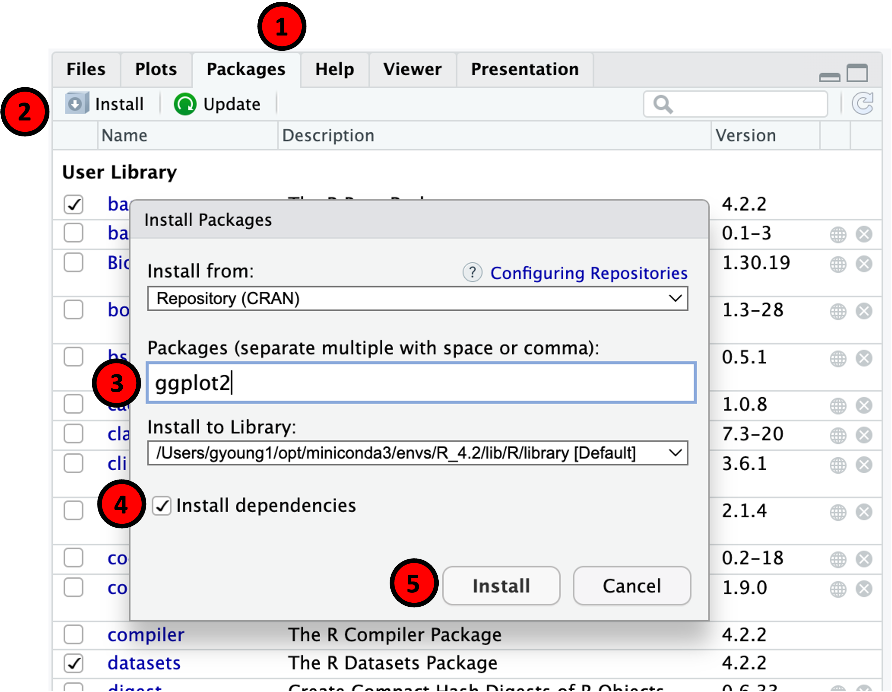

```{r setup, include=FALSE}
knitr::opts_chunk$set(echo=TRUE)
```

## Recapping

**Session 2** covered:

- Reading data (again)
  
- Writing data and images
  
- Saving objects

- Matrices and lists
  
- Coercion
  
- Recycling

- Conditional statements
  
- Loops

- Apply

## Recapping as code

```{r, eval=FALSE}
# Comments can be used to document code

# Writing data
write.table(
  x, "outputs/output.tsv",
  sep="\t", quote=FALSE, col.names=NA)

# Writing graphics
svg("outputs/my_image.svg")
  # a plot
dev.off()

# Matrices
m = as.matrix(my_data_frame)
m[1, 2] = "Neo"

# Transposition
t(m)
```

---

```{r, eval=FALSE}
# Lists
x = list(one=c(1, 2, 3), two=c(1, 2, 3))
x[["one"]] == x$two

# If
if (0 == 0) "yes" else "no"

# For loops
for (i in 1:5) print(i)

# While
i = 1
while (i != 5) i = i + 1

# Apply
apply(m, 1, sum)  # rows
apply(m, 2, sum)  # columns
```

## Homework {data-background=#FDEBD0}

What did you learn?

Do we need to recap any parts?

## Learning objectives

**Session 3**
  
- R markdown

- Writing functions

- Apply (again)

- Installing packages

- Using packages

- Real life example: DESeq2

## Markdown

In following along with this course, you've been seeing and using `R markdown` but we haven't yet considered it more deeply.

A markdown document provides a way of embedding the results of an analysis and, importantly, the code, within a formatted document. By allowing the two be stored side-by-side, markdown (and notebook-style workbooks in general), is central to modern data processing and reproducible analysis.

Starting a new `.Rmd` document from the menu (`File > New File > R Markdown`), we're given a new file containing:

- a minimal header section, which can be customised to describe how the document will be processed downstream (compare it to the monster at the top of this raw markdown!)

- and some demonstration content, which can be replaced with whatever you want to include.

In `R`, the `knitr` package provides the tools for converting markdown documents into everything from HTML reports to PowerPoint slides.

---

We can *knit* a document by pressing the knit button at the top of the documents pane, or by pressing `⌘+Shift+K` (Mac) or `CTRL+Shift+K` (Windows). `knitr` reads the header to determine which document formats to produce and *renders* them from its interpretation of the raw markdown.

As we've seen, code blocks wrapped within triple back ticks ...

````
 ```{r}
 # code
 ```
````

... will be executed and included, along with their results, inline with the surrounding text. These can be inserted at the position of the cursor with `⌘+⌥+I` (Mac) or `CTRL+Alt+I` (Windows).

The surrounding text can be annotated with a variety of formatting marks that are interpreted by `knitr`. This excellent [cheatsheet](https://www.rstudio.com/wp-content/uploads/2015/02/rmarkdown-cheatsheet.pdf) summarises the common ones.

Reproducing some of the most use useful ...

## {.columns-2}

Layout and objects:

- `# Title`

- `## Heading`

- `### Sub-heading`

- `***` horizontal rule

- `---` slide break

- `[link](https://www.example.com)`

-  ``

<p class="forceBreak"></p>

Text formatting:

- `*italics*` or `_italics_`

- `**bold**` or `__bold__`

- `^superscript^`

- `~subscript~`

- `> text` indented block quotation

- `-`, `*`, and `+` bullet / sub-bullets

- `1.`, `2.` ordered lists

## Writing functions

Although `R` has many built-in functions, not everything can be; there are often complex tasks we wish to perform regularly that are particular to our own work and for which no suitable function exists. For this, we can define our own.

Functions:

- are assigned to a variable name, as for any object

- are declared using `function()` and, generally, by defining some arguments

- wrap a code chunk in curly brackets (`{ }`) that performs a process or calculation

- return a value. If no value is returned explicitly, the result of the last function or calculation is returned instead or, else, `NULL`.

---

This simple function multiplies two numbers.

```{r}
multiply = function(x, y){
  result = x * y
  return(result)
}

multiply(4, 2)
```

Breaking it down:

- the function name is assigned using the `=` or `<-` operators, as normal

- the function is declared, using `function()`, and defined as requiring the arguments `x` and `y`

- a calculation is performed ... `result = x * y`

- and a result is explicitly returned using `return()`

---

As seen previously with built-in functions, by setting defaults, arguments can be made *optional*.

Additionally, where an optional argument is not passed and its default is used, `missing()` can let you know.

```{r}
multiply = function(x, y=2){
  if (missing(y)) print("y was not passed, defaulting to y=2")
  result = x * y
  return(result)
}

multiply(4)
```

---

Functions can only return a single object. Where multiple outputs need to be returned, they need to be bundled into a list.

```{r}
multiply = function(x, y=2, z=3){
  result = list(a=x*y, b=x*z)
  return(result)
}

multiply(4)
```

## Function scope

Within an `R` session, the collection of objects and functions defined are the *global environment*.

When running, functions - both in-built and user-defined - operate within an individual, separated, *scope*. Within a function's scope, or sub-environment:

- variables from the parental scope are available within the function as *free variables* (read-only copies)

- variables defined within functions are lost when the function returns

---

```{r}
x = 1; y = 2; z = 3

multiply = function(x){
  z = x * y
  return(z)
}

multiply(4)
```

In this example:

- `y` is accessed within `multiply()` as a free variable from the parental scope

- `z` is declared within the function and masks, but does not overwrite, the definition from the parental scope

- outside of the function's scope, `z == 3`. The parent's `z` is not modified.

---

Sometimes, however, we want to be able to modify variables within the parental scope. To do this we can use the special `<<-` operator.

```{r}
x = 1; y = 2; z = 3

multiply = function(x){
  z <<- x * y
}

multiply(4)
z
```

Here, `<<-` overwrites the `z` variable within the parental scope. Although nothing is passed back from the function using `return()`, `z` now stores its result instead.

## Practical {data-background=#D6EAF8}

For convenience, you've decided you'd like to have a function that returns the `mean()` and standard deviation (`sd()`) for a given vector together.

- Write a function `mean_sd` that accepts a vector input

- Make it calculate and return the mean and SD of the vector, returning the results as a list.

- Make a dummy matrix and `apply()` your function to its rows or columns

## Apply (again)

We've previously seen how `apply()` can be used to run a function across the rows or down the columns of a matrix. However, except when running basic arithmetic functions, it's common to also need to supply one or more positional or optional arguments.

`apply()`, and other functions that list `...` (an elipsis) in their function signature, allow for *pass through* of extra arguments that aren't relevant to them.

```{r, eval=FALSE}
?apply
```

```
Apply Functions Over Array Margins

Description
  Returns a vector or array or list of values obtained by applying a function to margins of an array or matrix.

Usage
  apply(X, MARGIN, FUN, ..., simplify = TRUE)
```

---

To pass through additional arguments, we specify them to `apply()`, which will pass them on on our behalf.

```{r}
m = matrix(1:9, nrow=3, ncol=3)
m
```

```{r}
multiply_sum = function(x, y) sum(x * y)

apply(m, 1, multiply_sum, y=2)
```

---

We can use the elipsis ourselves when writing functions by specifying `...` as an argument when defining the function and again within calls to the internal function that we'd like to pass the arguments on to.

```{r}
mean_sd = function(x, ...) {
  return(list(
    mean=mean(x, ...),
    sd=sd(x, ...)
  ))
}
```

This now allows arguments (e.g. `na.rm=TRUE`) to be passed to the internal functions on our behalf.

```{r}
mean_sd(c(1:5, NA), na.rm=TRUE)
```

## Libraries

We don't normally have to write too many functions ourselves - generally, someone's got there first!

Many libraries (/packages) are developed by the community to extend the capabilities of base `R`. Libraries can include functions and/or data sources, as well as documentation and tests.

There are two main repositories for `R` libraries:

- [CRAN]([https://cran.r-project.org/web/packages/available_packages_by_name.html) (the Comprehensive R Archive Network) provides many generic and mathematical packages

- [Bioconductor](https://bioconductor.org/packages/release/BiocViews.html#___Software) primarily provides packages for the analysis of biological data

Bioconductor hosts many of the most commonly used `R` packages for analysis of sequencing data outputs and downstream calculation of differential expression: `DESeq2`, `edgeR`, `DEXseq`, `Seurat`, `GenomicRanges`, `bioMart`, and `Rsamtools`, to name a few.

## CRAN

Packages from CRAN can be installed using the `install.packages()` function ...

```{r, eval=FALSE}
install.packages("ggplot2")
```

... or, alternatively, `RStudio` can automate the process.

<center>
{width="40%"}
</center>

## Bioconductor

Packages can be installed from Bioconductor using its dedicated installer, `BiocManager`, which is itself a library that can be installed from CRAN.

Having installed the `BiocManager` library ...

```{r, eval=FALSE}
install.packages("BiocManager")
```

... we can use it to install packages hosted by Bioconductor.

```{r, eval=FALSE}
library(BiocManager)

install("DESeq2")
```

## Updating libraries

`install.packages()` has a number of partner functions: `update.packages()`, `available.packages()`, `installed.packages()`, and `remove.packages()`. To update a library, usage is equivalent to installation.

```{r, eval=FALSE}
update.packages("ggplot2")
```

To update Bioconductor packages, we can simply run the install command again.

```{r, eval=FALSE}
install("DESeq2")
```

## Github

Although CRAN and Bioconductor are by far the most common, a subset of packages are released via GitHub (or GitLab, Bitbucket, ...).

These can be installed using the `install_...()` family of functions from the `remotes` library.

Having installed `remotes` ...

```{r, eval=FALSE}
install.packages("remotes")
```

... we can use `install_github()`, for example, to install packages directly.

<center>
{width="30%"}
</center>

```{r, eval=FALSE}
library(remotes)

install_github("Displayr/flipPlots")
```

## Using libraries

In order to make use of them, a library's functions must first be loaded into your `R` environment. As seen for `install()` from `BiocManager` and for `install_github()` from `remotes`, packages are loaded using the `library()` function.

```{r, eval=FALSE}
library("BiocManager")
```

A list of the libraries currently loaded by the user can be obtained ... 

```{r}
(.packages())  # note the wrapping brackets
```

... or a more comprehensive output, including package dependencies and version numbers can be obtained using `sessionInfo()`.

```{r, eval=FALSE}
sessionInfo()
```

---

Once a package has been loaded, we can use its functions directly ...

```{r, eval=FALSE}
install()
```

... or by referencing them alongside their package using the `package::function()` syntax.

```{r, eval=FALSE}
BiocManager::install()
```

Although it's not generally necessary, this method can help to improve the clarity of your code by explicitly referencing the package that supplies a selected function.

Sometimes, however, it is necessary - for example when two packages supply a function of the same name.

---

The documentation for individual package functions can be queried using the `?` operator, as for in-built functions.

Additionally, documentation for the library itself can be viewed using the `??` operator.

```{r, eval=FALSE}
??BiocManager
```

This output includes links to the package's *vignettes* - HTML pages or PDFs that walk through how to use it, often following a dummy workflow with an exemplar dataset.

If you want to get to grips with the basic functionality of a package, its vignette is the place to start!


## Real life

As the best way to learn something is to walk through a workflow with a dummy dataset, we're going to walk over a standard workflow for a differential gene expression analysis of some bulk Illumina RNAseq using the popular `DESeq2` package.

Walking through the analysis steps, we will:

- install and load the relevant packages

- load the sample meta data table and the raw count data

- create a `DESeqDataSet` object

- QC and sense-check the data

- run a test for differential expression between groups

- extract and process the results

- visualise the results

## Getting set up

First things first, we'll need to install the relevant packages ...

```{r, eval=FALSE}
install.packages(c("tidyverse", "ashr"))
```

```{r, eval=FALSE}
library(BiocManager)
install(c("DESeq2", "ihw"))
```

... after which, we can load what we need.

```{r, message=FALSE}
library("DESeq2")
```

## Meta data

To begin with, let's look at the experiment we're going to be working with

```{r}
meta_data = read.delim("data/3_penguin_metadata.tsv", row.names=1)
table(meta_data)
```

It looks like we're back to analysing some penguin data! This is an experiment with 8 samples, 4 `Adelie` and 4 `Gentoo` and, for each group, we have 3 `F` and 1 `M` samples.

Let's make sure that the two columns in our `meta_data` table are set up properly as factors.

```{r}
meta_data$Species = factor(meta_data$Species)
meta_data$Sex = factor(meta_data$Sex)
```

## Expression data

Now that we have the meta data loaded, the next step is to get the expression data.

```{r}
exprs = read.delim("data/2_penguin_expression.tsv", row.names=1)
exprs = as.matrix(exprs)

dim(exprs)
```

We can do a quick sense-check to make sure that the row names of our meta data table match the column names of our matrix.

```{r}
all(rownames(meta_data) %in% colnames(exprs))
```

---

Some (gentle) streamlining of our data as this point is a good way of decreasing processing time and memory requirements downstream.

Let's clean up our expression matrix by removing rows for which no sample recorded expression of the gene - we're never going to find these to be differentially expressed!

```{r}
exprs = exprs[rowSums(exprs)>0, ]

dim(exprs)
```

This is a loss-less approach. Slightly more 'active' approaches might be to:

- remove rows where very few samples recorded expression

- perform the above filter, but using a different cutoff (e.g. `>=10`, which is recommended in the `DESeq2` vignette)

- combine both of these approaches

---

We'll leave the table how it is but, out of interest, let's see what impact these three strategies would have on the size of the expression matrix.

```{r}
# we require >=10 Illumina reads to be recorded for each gene
dim(exprs[rowSums(exprs)>=10, ])
```

```{r}
# we require >=2 samples to record expression for each gene
dim(exprs[rowSums(exprs>0)>=2, ])
```

```{r}
# we require >=2 samples to record >=10 Illumina reads for each gene
dim(exprs[rowSums(exprs>=10)>=2, ])
```

## Creating a DESeqDataSet object

Once we're happy with our two tables, we can load them together into `DESeq2` to make a `DESeqDataSet` object. To do this, we need to first think about the design of our experiment and the technical and confounding factors that might influence our interpretation of the data.

Here, we have two factors (`Species` and `Sex`) that have a strong potential to influence expression data recorded for a sample. We start by putting this into a *design* using formula notation.

```{r}
dds_design = ~ Species + Sex
```

As we have a ready-made matrix, we use the `DESeqDataSetFromMatrix()` function to set up a `DESeqDataSet` object, but there are several equivalents that allow integration of data from different sources.

```{r, cache=TRUE}
dds = DESeqDataSetFromMatrix(
  countData=exprs,
  colData=meta_data,
  design=dds_design)
```

---

Let's have a look at what we made.

```{r}
dds
```

--- 

We haven't seen anything quite like this so far. A `DESeqDataSet` object is an object *class* itself, of which our `dds` is an example. 

```{r}
class(dds)
```

`S3 objects` like this can store a mixture of data, similarly to list objects, but also define functions to control how `R` interacts with them.

The `DESeqDataSet` object draws from (is a *sub-class* of) another class, `SummarisedExperiment`, which has a generic structure storing:

- phenotype data (i.e. the meta data) accessed with `colData()`

- feature data (information about the genes or features) accessed with `rowData()`

- assays of the features - one or more datasets associated with the given features - accessed with `assay()`

---

<center>
{width=60%}
</center>

---

Our `dds` object contains a single assay that stores our raw expression data: `counts`. We can access this using the generic `assay()` function inherited from the `SummarisedExperiment` class ...

```{r}
head(assay(dds, "counts"), 3)
```

... or using the special `counts()` function built into the `DESeqDataSet` class.

```{r}
head(counts(dds), 3)
```

## Visualising the data

To begin to visualise the data or to use it for clustering, we need to normalise it. `DESeq2` itself will only ever use the raw data when doing statistical testing, but for other applications, it must first be normalised.

`DESeq2`'s `rlog()` function performs regularised log transformation, in turn:

- transforming the raw data to a log2 scale

- adjusting for differences in sequencing depth (standardisation of per-sample counts)

- compressing the variance for genes with low counts (to prevent run-away fold changes)

```{r, cache=TRUE}
rld = rlog(dds)
```

`rlog()` performs a robust normalisation but this can be slow where there are large numbers of samples. A slimmed-down alternative, `vst()`, is available where this becomes an issue.

---

The normalised data can then be used as an input for principal component analysis (PCA) ...

```{r, cache=TRUE, out.width="60%", fig.align="center"}
plotPCA(rld, intgroup=c("Species", "Sex"))
```

---

... or for hierarchical clustering.

```{r, cache=TRUE, out.width="50%", fig.align="center"}
euc_dist = dist(t(assay(rld)), method="euclidean")
tree = hclust(euc_dist)
tree = as.dendrogram(tree)

plot(tree)
```

## Running DESeq2

To allow us to do some statistical testing between the conditions, we run the `DESeq()` function ...

```{r, cache=TRUE, message=FALSE}
dds = DESeq(dds)
```

... which then allows for specific comparisons to be extracted from the results.

```{r, cache=TRUE}
res = results(
  dds,
  contrast=c("Species", "Adelie", "Gentoo"),
  alpha=0.05,
  filterFun=IHW::ihw)
```

Here, we supply `alpha`, the false discovery rate, which otherwise defaults to `alpha=0.1`. We also use a method of power optimisation, independent hypothesis weighting (`ihw()` from the `IHW` package), to make sure we're getting the best out of our data.

---

```{r}
summary(res)
```

## Visualising the results

`DESeq2` has a built-in method for displaying the results - the MA plot graphs fold change (y axis) against expression (x axis) for a given comparison.

The function accepts our selected false discovery rate (alpha) to colour significant genes automatically.

```{r, out.width="45%", fig.align="center"}
plotMA(res, alpha=0.05)
```

---

It's clear that the genes with low expression have aberrant fold change values. To prevent these from impacting downstream analyses, we can correct for their low expression by applying a method of fold change shrinkage.

We'll use `ashr()` from the `ashr` package, but `DESeq2` supports several methods for this. Let's update the results object with the corrected values and take another look at the MA plot.

```{r, cache=TRUE, message=FALSE, out.width="45%", fig.align="center"}
res = lfcShrink(dds, res=res, type="ashr")
plotMA(res, alpha=0.05)
```

---

R has a trick up its sleeve to help interact with graphs. `identify()` allows, for graphs plotted from the console, you to select points interactively.

Pressing `ESC` or the Finish button in `RStudio` ends the interactive selection and returns a vector of the row indexes of the points selected.

```{r, eval=FALSE}
plotMA(res, alpha=0.05)

genes = identify(res$baseMean, res$log2FoldChange)
genes  # for example 
```
```
2067  2498  3929  17098
```

```{r, eval=FALSE}
genes = rownames(res)[genes]
genes  # for example 
```
```
"PENG0000002999"  "PENG0000003622"  "PENG0000005731"  "PENG0000024914")
```

---

Gene names (the row names of the `dds` object) can be used as input to `DESeq2`'s `plotCounts()` function to view expression for an individual gene subset by a given grouping (`intgroup=`).

```{r, include=FALSE}
genes = c("PENG0000002999", "PENG0000003622", "PENG0000005731", "PENG0000024914")
```

```{r, out.width="60%", fig.align="center"}
plotCounts(dds, gene=genes[1], intgroup="Species")
```

## Formatting the results

Now that we've applied the fold change shrinkage, let's neaten the results up into a data frame that we could share. We'll:

- remove the `NA`-containing lines

- filter to keep only those genes significant at our chosen `alpha`

- filter to keep only those genes that were also >= 2-fold differentially expressed (absolute)

- sort the data by fold change, high to low

```{r}
res_table = data.frame(na.omit(res))
res_table = res_table[res_table$padj<0.05 & abs(res_table$log2FoldChange)>=1, ]
res_table = res_table[order(-res_table$log2FoldChange), ]

dim(res_table)
```

## Save our work

Finally, let's make sure we've saved our progress so that we can resume from where we left off when we come back to it.

We'll save the important `R` objects ...

```{r, eval=FALSE}
save(list=c("dds", "res"), file="outputs/3_penguin_analysis.Rdata")
```

... and export the results as a spreadsheet.

```{r, eval=FALSE}
write.table(
  res_table,
  file="outputs/3_penguin_analysis.tsv",
  sep="\t", row.names=T, col.names=NA)
```

## Homework {data-background=#FDEBD0}

There are more penguin-related homework tasks to help cement what we've covered today!

The homework and instructions can be found within the main directory for the course: `./homework/Homework_3.Rmd`
