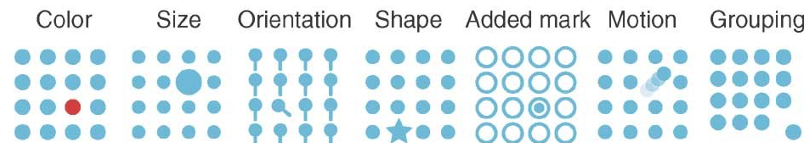
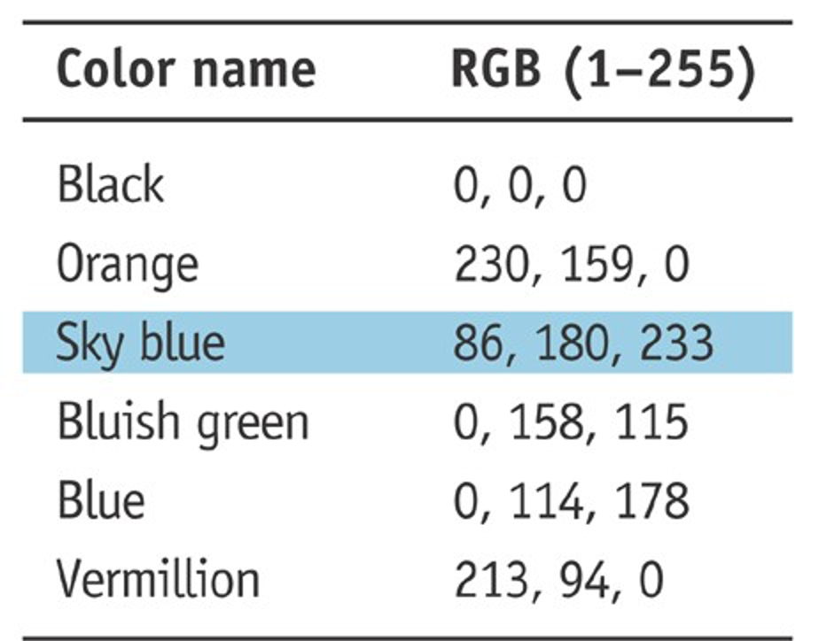
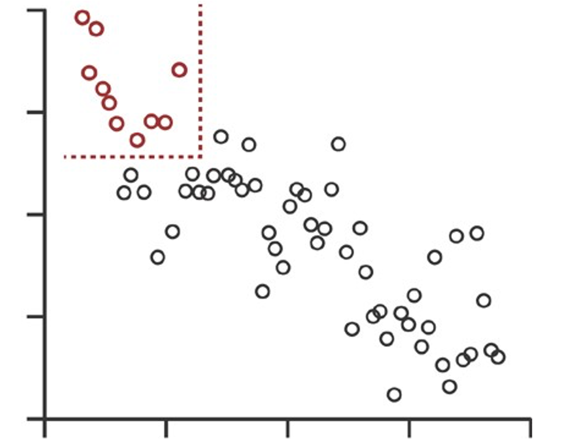
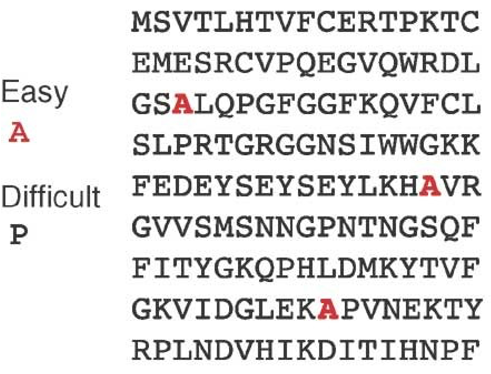
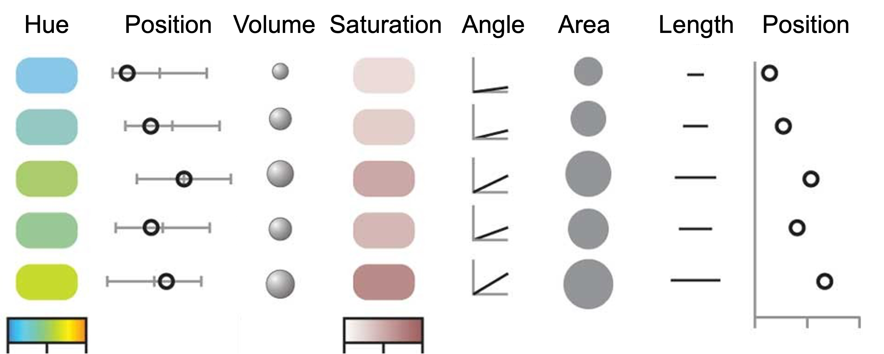
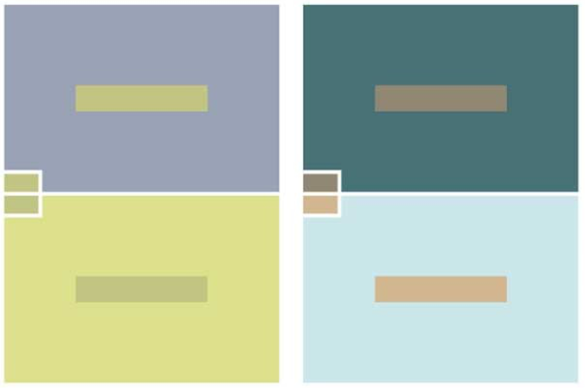
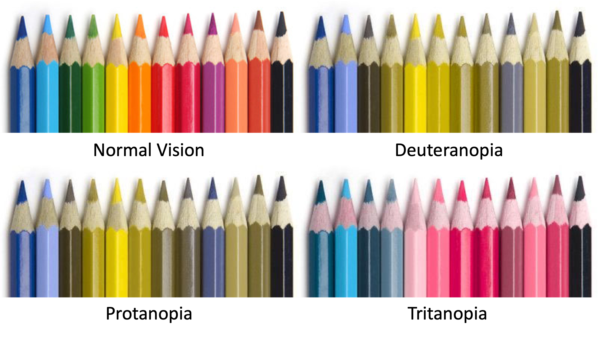

```{r setup, include=FALSE}
knitr::opts_chunk$set(echo=TRUE)
```

## Recapping

**Session 3** covered:

- R markdown

- Writing functions

- Apply (again)

- Installing packages

- Using packages

- Real life example: DESeq2

## Recapping as code

```{r, eval=FALSE}
# Functions
multiply = function(x, y) return (x * y)

# Default arguments
multiply = function(x, y=2) return (x * y)

# Scopes
multiply = function(x, y) z <<- x * y

# Passing through arguments
apply(m, 1, multiply, y=2)

# Packages from CRAN
install.packages("ggplot2")

# Packges from Bioconductor
library(BiocManager)
install("DESeq2")
```

## Homework {data-background=#FDEBD0}

What did you learn?

Do we need to recap any parts?

## Learning objectives

**Session 4**
  
- What makes a good figure?
  
- Colour
  
- `viridis` colour library
  
- Plotting with `ggplot2`

  * Aesthetics
  
  * Geometries
  
  * Themes
  
  * Facets
  
  * Saving

## Plotting

Humans are visual creatures!

Visualisation of large data sets is an essential task in molecular biology and medicine. When done effectively, images can help you to explain the most complex of data.

Without an image or summarisation, how well would you do finding significant genes passing a given fold change threshold in a table like this?

```{r, echo=FALSE}
load("outputs/3_penguin_analysis.Rdata")
head(data.frame(res), 12)
```

## What makes a good figure?

There are a few key points you need to condider when deciding upon a method of visualisation:

- *relevance*: the message a figure needs to convey

- *salience*: how easily the eye can distringuish your message from the background

- *accuracy*: how exactly different visualisation methods may convey your message

Especially when presenting (when the audience is listening and reading), it's vital that salience and relevance are aligned.

## Salience

Human vision is highly selective. We understand visual information by selecting, in turn, individual objects or aspects for detailed analysis rather than by appreciating an entire scene.

Formally, salience is the property of an object that sets it apart from its surroundings; it's a relative properly, therefore, and depends on the collection of objects being visualised.

We can enhance salience by manipulating color, shape, size, and position to focus attention.

<center>
{width="70%"}
</center>

---

It's not inherently different to make information salient ...

<center>
{width="30%"}
{width="30%"}
{width="30%"} 
</center>

... what's important is that the salient points of a figure align with what's relevant.

Nevertheless, it's also easy to reduce salience by:

- displaying too much information together

- attempting to convey different points of relevance within the same image

- referring to points of relevance that are tangential to what's salient

## Accuracy

When displaying a graphic, we want the viewer to be able to perceive the patterns and trends that convey the relevant point.

Humans are better able to interpret certain visual cues better than others, however - interpretation is subjective and everyone's different! Let's try and rank the following methods of conveying the same information:

<center>
{width="70%"}
</center>

---

Research in the field of visual theory has shown that, in order, people are best able to understand:

1. positions on a common aligned scale

2. positions on unaligned scales that are otherwise common

3. lengths

4. angles and slopes

5. area

6. volume and colour saturation

7. colour hue

## Colour

Unfortunately, although it's often a go-to method, colour is amongst the least reliable methods of conveying information!

This is worsened by the fact that colour perception is relative. We distinguish colours differently depending on their surroundings and can be easily tricked into seeing the same colour differently or into seeing different colours similarly.

<center>
{width="40%"}
</center>

---

<center>
{width="35%"}
</center>

## Colour vision deficiency

Not only can be we be fooled into perceiving colours contextually, people differ in their ability to distinguish colours based on their genetics.

Colour blindness (*colour vision deficiency* or CVD) is a sliding scale and there are a number of different types. 'Full' phenotypes for the three more common forms of CVD are show here.

<center>
{width="55%"}
</center>

---

Across populations with Northern European ancestry, up to 1/12 males and 1/200 females have some level of red-green CVD. UK-wide, 4.5% of the population have some level of CVD and, even by the time they leave school, approximately 40% are unaware.

When producing figures that make use of colour, if we want them to be salient, it's important to be inclusive! Thankfully, a number of colour scales have been developed that allow figures to retain salience for those with CVD.

<center>
{width="60%"}
</center>

## Viridis colour library

The `viridis` library provides color maps for use in `R` that are:

- colourful, spanning as wide a palette as possible

- perceptually uniform, such that, across the whole range, nearby values have similar-appearing colors and distant values appear more distinct

- friendly for those with colour vision deficiency

`viridis` can be installed from CRAN.

```{r, eval=FALSE}
install.packages("viridis")
```

## Plotting in R

Although base `R` can produce a variety of plots, getting them to be 'just so' can be extremely difficult!

These days, virtually all 'pretty' plotting is done with the `ggplot2` library.

```{r, eval=FALSE}
install.packages("ggplot2")
```

Given its popularity, lots of libraries interface with `ggplot2` (e.g. `viridis`). To complement `ggplot2`, we'll also install `patchwork`, which helps to layout plots in rows and grids.

```{r, eval=FALSE}
install.packages("patchwork")
```

```{r}
library("ggplot2")
library("patchwork")
```

## ggplot

The central `ggplot()` function provides a consistent interface to map *data* to the *aesthetics* of *geometries*.

In other words:

- the tabular *data* that we wish to plot ...

- ... has various facets, which we map to the *aesthetic* properties we can perceive (position, colour, shape, size, and transparency) ...

- ... of various *geometric* methods of displaying the data (bars, points, lines, etc)

---

Most commonly, we make a plot by passing the `ggplot()` function two arguments:

- `data`, which takes a data frame (or something that can be coerced to one)

- `mapping`, which uses the `aes()` function to define the aesthetic mappings we'd like to use

```{r}
penguins = na.omit(read.csv("data/1_palmerpenguins.csv"))
penguins$species = factor(penguins$species)
penguins$island = factor(penguins$island)
penguins$sex = factor(penguins$sex)
penguins$year = factor(penguins$year, ordered=TRUE)
```

```{r}
g = ggplot(penguins, aes(x=bill_length_mm, y=bill_depth_mm))
class(g)
```

Here, we've instantiated a `ggplot` object with the `penguins` data frame and defined two simple aesthetics - that the `x` axis should display `bill_length_mm` and that `y` should display `bill_depth_mm`.

---

Let's have a look at what we've made.

```{r, message=FALSE, warning=FALSE, out.width="40%", fig.align="center"}
g
```

Beautiful, we're finished!

Remember that a `ggplot` requires data, aesthetics, and geometries. So far, we haven't added any geometries to our plot. We can think of a `ggplot` as a painting; `ggplot()` provides the canvas and the geometries provide the layers of paint.

## Geometries

Geometries (`geom_...()` functions) added to a `ggplot2` display data according to the aesthetics defined in the `ggplot` object. Geometries are added (literally, as we use the `+` operator) to the `ggplot` and we reassign the result to the original object variable name.

```{r, message=FALSE, warning=FALSE, out.width="40%", fig.align="center"}
g = g + geom_point()
g
```

Now we can see something!

## Aesthetics

What we have so far is a little simplistic! Let's re-work the aesthetics by getting the `ggplot` object to colour according to the levels of the `species` factor (`color` and `col` are also valid if you're not British).

```{r, message=FALSE, warning=FALSE, out.width="40%", fig.align="center"}
g =
  ggplot(penguins, aes(x=bill_length_mm, y=bill_depth_mm, colour=species)) +
  geom_point()
g
```

---

The aesthetic properties defined in the `ggplot()` function call are set as the defaults for all geometries, provided they're applicable. All geometries added will be passed these defaults.

```{r, message=FALSE, warning=FALSE, out.width="40%", fig.align="center"}
g +
  geom_smooth(method="lm")
```

Here, the linear model (`method="lm"`) trend lines we add using `geom_smooth()` inherit their `colour` aesthetic from the `ggplot` parent object.

## Practical {data-background=#D6EAF8}

Let's make our first `ggplot`!

- Set up a `ggplot` object of displaying `flipper_length_mm` against `body_mass_g`

- Add a `colour` aesthetic to the plot

- Add a `geom_smooth(method="lm")` geometry to the plot

- What happens if we exchange `geom_point()` for `geom_density2d()`?

## Partitioning with aesthetics

The more facets of the data we map to aesthetics, the more it's partitioned.

```{r, message=FALSE, warning=FALSE, out.width="40%", fig.align="center"}
g = ggplot(penguins, aes(x=bill_length_mm, y=bill_depth_mm, colour=species, shape=sex))
g +
  geom_point() +
  geom_smooth(method="lm")
```

Here, the `shape=sex` aesthetic further subdivided the data by `sex`, giving 6 trend lines instead of 3.

---

We don't always want our geometries to inherit all of the defaults passed to the `ggplot()` function, therefore! Thankfully:

- individual geometries can have alternate aesthetics passed using the `mapping=` argument, which allows individual aesthetic parameters to be reset to `NULL`.

  `geom_point(mapping=aes(shape=NULL))`

- aesthetics can be manually specified for all data by passing the aesthetic parameter as an argument itself

  `geom_point(colour="black")`

---

Here, we pass `alpha=0.5` to `geom_point()` to manually set the alpha (transparency) of the points. Additionally, we override the `shape` aesthetic within `geom_smooth()` by setting it to `NULL` so that we don't duplicate our trend lines.

```{r, message=FALSE, warning=FALSE, out.width="40%", fig.align="center"}
g = 
  g +
  geom_point(alpha=0.5) +
  geom_smooth(mapping=aes(shape=NULL), method="lm")
g
```

---

Some aesthetics are only available for specific geometries and, depending on the geometry, certain aesthetic options are more relevant or salient than others.

As a general guide, discrete variables are best visually separated with ...

- `shape` (for points) for very small numbers of discrete groups and where overlapping is minimal

- `linetype` (for lines) for very small numbers of discrete groups

- `colour` (or `fill` for filled geometries) using separate hues

... whereas continuous variables are most accurately displayed using:

- `size` or `lineweight`

- a scaled gradient across distant `colour` hues

- a scaled gradient across a single `colour`

- `alpha`, if necessary

## Themes

Separately to the aesthetics of the geometries, we can control other visual aspects of the plot by modifying the `theme()` defaults or by using one of the `theme_...()` presets. We can also use the `labs()` function to control the axis and plot titles.

```{r, message=FALSE, warning=FALSE, out.width="40%", fig.align="center"}
g +
  theme_bw() +
  labs(x="Bill length (mm)", y="Bill depth (mm)", title="Graph with theme_bw()")
```

## Practical {data-background=#D6EAF8}

Let's add some style to our `ggplot`. 

- Update your previous plot to use a theme preset. Try out `theme_bw()`, `theme_classic()`, and `theme_minimal()`.

- Even when using a theme preset, we can still override specific elements using `theme()`. What does adding `theme(axis.text.y=element_text(angle=90, vjust=0.5, hjust=0.5))` achieve?

- How might we rotate the labels for the x axis?

- Looking at the help for `element_text()`, how might we change the size of the `plot.title` element?

## Different geometries

There are many geometries available to help display data of different formats. The majority of graphing applications fall into five groups:

- single continuous variable: `geom_freqpoly()`, `geom_histogram()`, `geom_area()`, `geom_density()`

- single discrete variable: `geom_bar()`

- two continuous variables: `geom_point()`, `geom_smooth()`, `geom_rug()`, `geom_density_2d()`

- two variables, one continuous and one discrete: `geom_boxplot()`, `geom_violin()`, `geom_dotplot()`, `geom_jitter()`, `geom_col()`
  
- two discrete variables: `geom_count()`, `geom_jitter()`

---

Let's see a few options for plotting a continuous against a discrete variable.

```{r, echo=FALSE, message=FALSE, warning=FALSE, out.width="60%", fig.align="center"}
g = 
  ggplot(penguins, aes(x=species, y=body_mass_g, colour=species)) +
  theme_bw() +
  theme(
    axis.title.x=element_blank(),
    legend.position="none")

a = 
  g +
  geom_boxplot() +
  labs(
    title="geom_boxplot()",
    y="Body Mass (g)") +
  theme(
    axis.text.x=element_blank(),
    axis.title.x=element_blank())
b =
  g +
  geom_violin() +
  labs(title="geom_violin()") +
  theme(
    axis.text.y=element_blank(),
    axis.title.y=element_blank(),
    axis.text.x=element_text(angle=45, vjust=0.5, hjust=0.5))
c = 
  g + 
  geom_jitter() + 
  labs(title="geom_jitter()") +
  theme(
    axis.title.y=element_blank(),
    axis.text=element_blank())

a + b + c
```

Different geometries can be used to highlight - make salient - different aspects of the data. Here, `geom_boxplot()` better shows the position of the median value, whereas `geom_violin()` better highlights the spread of the data and `geom_jitter()` might do that too much!

---

Let's see a few options for plotting two continuous variables against each other.

```{r, echo=FALSE, message=FALSE, warning=FALSE, out.width="60%", fig.align="center"}
g = 
  ggplot(penguins, aes(x=body_mass_g, y=flipper_length_mm, colour=species)) +
  theme_bw() +
  theme(legend.position="none") +
  lims(x=c(2500, 6500), y=c(170, 235))

a = 
  g +
  geom_point() +
  labs(
    title="geom_point()",
    y="Flipper Length (mm)") +
  theme(
    axis.text.x=element_blank(),
    axis.title.x=element_blank())
b =
  g +
  geom_rug() +
  labs(
    title="geom_rug()",
    x="Body Mass (g)") +
  theme(
    axis.text.y=element_blank(),
    axis.title.y=element_blank())
c = 
  g + 
  geom_density2d() + 
  labs(title='geom_density2d()') +
  theme(
    axis.text=element_blank(),
    axis.title=element_blank())

a + b + c
```

Here, as an alternative to `geom_point()`, `geom_density2d()` may better highlight the 'centre of mass' for each group. `geom_rug()` might be suitable alongside another geometry but otherwise lacks both accuracy and saliency.

## Practical {data-background=#D6EAF8}

Using this base ...

```{r, eval=FALSE}
ggplot(penguins, aes(x=body_mass_g, colour=species))
```

... let's compare a couple of options for plotting a single continuous variable.

- Add a `geom_histogram()` to the plot

- Switch that for a `geom_freqpoly()`

- Which plot has better accuracy and saliency?

## Using colour properly

Let's apply some of our knowledge about using colour effectively ... and inclusively!

The `viridis` library integrates easily with `ggplot2` using various `scale_colour_viridis_...()` and `scale_fill_viridis_...()` functions:

- `scale_colour_viridis_d()` makes salient mappings of discrete variables

- `scale_colour_viridis_c()` makes accurately distinguishable mappings for continuous variables

- `scale_colour_viridis_b()` merges the two - continuous variables are binned to enhance salience

---

Let's start by replacing `ggplot2`'s default colour scheme for discrete variables using the `scale_colour_viridis_d()` function.

```{r, message=FALSE, warning=FALSE, out.width="40%", fig.align="center"}
ggplot(penguins, aes(x=body_mass_g, y=flipper_length_mm, colour=species)) +
  geom_point() +
  theme_bw() +
  scale_colour_viridis_d()
```

Pretty easy!

---

As we saw earlier, `viridis` has a variety of palettes. Let's compare a few on some discrete data by passing the `option=` argument to the `scale_colour_viridis_d()` function.

```{r, echo=FALSE, message=FALSE, warning=FALSE, out.width="60%", fig.align="center"}
g = 
  ggplot(penguins, aes(x=body_mass_g, y=flipper_length_mm, colour=species)) +
  geom_point() +
  theme_bw() +
  theme(legend.position="none")

a = 
  g +
  labs(
    title="ggplot default",
    y="Flipper Length (mm)",
    x="Body Mass (g)")
b = 
  g +
  scale_colour_viridis_d(option="viridis") +
  labs(title='option="viridis"') +
  theme(
    axis.text=element_blank(),
    axis.title=element_blank())
c =
  g +
  scale_colour_viridis_d(option="plasma") +
  labs(title='option="plasma"') +
  theme(
    axis.text=element_blank(),
    axis.title=element_blank())
d = 
  g + 
  scale_colour_viridis_d(option="turbo") +
  labs(title='option="turbo"') +
  theme(
    axis.text=element_blank(),
    axis.title=element_blank())

a + b + c + d
```

## Practical {data-background=#D6EAF8}

Using this base ...

```{r, eval=FALSE}
ggplot(penguins, aes(x=bill_length_mm, y=bill_depth_mm, colour=bill_length_mm/bill_depth_mm))
```

- What are we doing in the `colour` aesthetic?

- Make a graph making use of `scale_colour_viridis_c()`

- Try a few different palettes by setting `option=`

- Switch that out for `scale_colour_viridis_b()`

- Within this nonsense example, which method has:

  * better accuracy?
  
  * better saliency?

## Facets

Where we need to highlight two separate points within a plot, it's common to incorporate the second factor using a separate aesthetic (e.g. as a symbol if we're primarily using colour). However, mixing or increasing the complexity of aesthetics can lead to poor saliency!

```{r, message=FALSE, warning=FALSE, out.width="40%", fig.align="center"}
g = ggplot(na.omit(penguins), aes(x=bill_length_mm, y=bill_depth_mm, colour=species)) +
  scale_colour_viridis_d(option="turbo") +
  theme_bw()
g + geom_point(aes(shape=sex))
```

---

Often, a better alternative is to *facet* the data by the second factor.

`facet_wrap()` will use a factor (/factors) specified using formula notation to split the dataset into separate, grouped, plots.

```{r, message=FALSE, warning=FALSE, out.width="50%", fig.align="center"}
g = g + geom_point()
g +
  facet_wrap(~sex)
```

---

Alternatively, dor more complex layouts, we can use `facet_grid()` to produce a 2D grid.

```{r, message=FALSE, warning=FALSE, out.width="50%", fig.align="center"}
g = g + facet_grid(rows=vars(sex), cols=vars(species))
g
```

For `facet_grid()`, it's necessary to use `ggplot2`'s `vars()` function to extract the levels from the factors you're faceting with.

## Practical {data-background=#D6EAF8}

Using this base ...

```{r, eval=FALSE}
ggplot(na.omit(penguins), aes(x=body_mass_g, colour=species))
```

- Make a plot using `geom_density()` to display the distribution of `body_mass_g` or each `species`

Let's see if there's variation in their weight by year.

- Add a `facet_grid()` that separates by `year` and `sex`

## Scales

There are two ways of adjusting the axis scales in `ggplot2`:

- setting everything outside of a specified window to `NA`. This is achieved by setting `limits=` within the relevant `scale_...()` function

  `scale_x_continuous(limits=c(1, 100))`

- zooming into a region without otherwise manipulating the data. This is achieved by setting `xlim=` and `ylim=` using the `coord_cartesian()` function

  `coord_cartesian(xlim=c(1, 100))`

These differ in whether the non-visible points are used to contribute information to the plot:

- `limits` prevents this. A `geom_smooth()` geometry will create a fit using only the points displayed

- `coord_cartesian()` enables this. A `geom_smooth()` geometry will create a fit using all data, even if it's not displayed.

## Reference lines

Alongside the adjustment of the scales, it's often useful to be able to add reference or threshold lines to a plot to enhance saliency.

`ggplot2` has three geometries that allow this: 

- `geom_hline()`, taking a `yintercept` argument

- `geom_vline()`, taking a `xintercept` argument

- `geom_abline()`, taking `slope` and `intercept` arguments

---

```{r, message=FALSE, warning=FALSE, out.width="40%", fig.align="center"}
g = 
  ggplot(na.omit(penguins), aes(x=species, y=body_mass_g, colour=species)) +
  geom_violin(fill=NA) +
  geom_hline(yintercept=3000, linetype="dashed") +
  theme_bw()
g
```

## Labels

It's also possible to add text annotations to a plot using `annotate()` elements, using the `x` and `y` arguments to position the text.

```{r, message=FALSE, warning=FALSE, out.width="40%", fig.align="center"}
g = g + annotate("text", x=3.3, y=2900, label="Underweight")
g
```

For the purposes of display (and for positioning labels), categorical data, as above, are converted to sequences of integers (1, 2, 3, ...) on the `x` axis.

---

It's also possible to label specific points within a plot using `geom_text()` or `geom_text_repel()` from the `ggrepel` package, which repels labels from each other to prevent overlap.

Where there are only a few points, this works without further effort. Where there are lots, it's more common to be needing to specifically label a specific subset. To do this, we supply new `data` to the geometry.

```{r, message=FALSE, warning=FALSE, out.width="40%", fig.align="center"}
g +
  geom_text(aes(label=id), data=penguins[sample(nrow(penguins), 5), ])
```

## Saving

Saving `ggplot` objects is simpler than for base `R` graphics.

`ggplot2` has a special `ggsave()` function that will adjust `width` and `height` in a variety of `units` and save in 10 different formats!

```{r, eval=FALSE}
ggsave(
  "outputs/4_ggsave.png", g,
  height=10, width=15, units="cm")
```

Here, we pass a specific `ggplot` object to save but, by default, it saves the last displayed plot.

The `ggsave()` function is also clever enough to guess the required `device` (`png`, `svg`, `pdf`, etc) from the file extension given in the path name; we can specify this for clarity but it's not necessary.

## Homework {data-background=#FDEBD0}

There are more penguin-related homework tasks to help cement what we've covered today!

The homework and instructions can be found within the main directory for the course: `./homework/Homework_4.Rmd`
